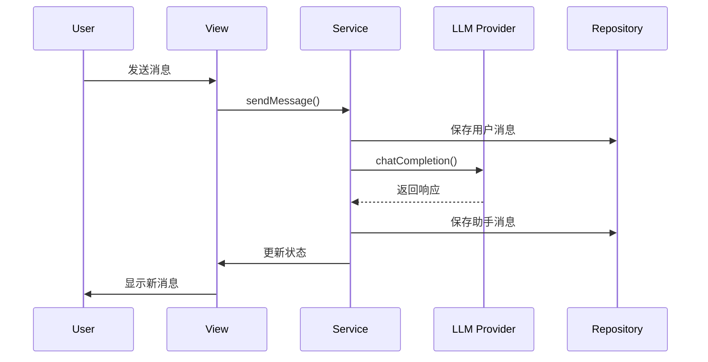

# Obsidian Intelligence Assistant - 新架构文档

## 📋 概述

本文档描述了 Obsidian Intelligence Assistant 项目的全新架构设计，旨在提高可维护性、可读性和灵活性。

## 🏗️ 整体架构

### 架构原则

1. **关注点分离 (Separation of Concerns)**
   - 每层有明确的职责
   - 依赖关系单向流动
   - 模块间低耦合

2. **依赖注入 (Dependency Injection)**
   - 接口驱动开发
   - 便于测试和模拟
   - 运行时依赖管理

3. **工厂模式 (Factory Pattern)**
   - 统一的创建逻辑
   - 配置驱动的实例化
   - 动态类型支持

4. **插件化架构 (Plugin Architecture)**
   - 可扩展的组件系统
   - 热插拔支持
   - 版本兼容管理

### 分层架构

```
┌─────────────────────────────────────────────────────────────┐
│                    Presentation Layer                   │
│  ┌─────────────┐  ┌─────────────┐  ┌─────────┐│
│  │   Views     │  │ Components  │  │  State  ││
│  └─────────────┘  └─────────────┘  └─────────┘│
└─────────────────────────────────────────────────────────────┘
┌─────────────────────────────────────────────────────────────┐
│                   Application Layer                    │
│  ┌─────────────┐  ┌─────────┐                  │
│  │  Services   │  │  Utils   │                  │
│  └─────────────┘  └─────────┘                  │
└─────────────────────────────────────────────────────────────┘
┌─────────────────────────────────────────────────────────────┐
│                    Domain Layer                       │
│  ┌─────────────┐  ┌─────────────┐  ┌─────────┐│
│  │  Entities   │  │  Models     │  │ Events  ││
│  └─────────────┘  └─────────────┘  └─────────┘│
└─────────────────────────────────────────────────────────────┘
┌─────────────────────────────────────────────────────────────┐
│                Infrastructure Layer                  │
│  ┌─────────────┐  ┌─────────────┐  ┌─────────┐│
│  │  LLM        │  │ Persistence │  │ Config  ││
│  │  Providers  │  │   Repos     │  │ Manager ││
│  └─────────────┘  └─────────────┘  └─────────┘│
└─────────────────────────────────────────────────────────────┘
```

## 🔧 核心组件详解

### 1. Core Layer (核心层)

#### 接口定义
```typescript
// 服务接口
interface IService {
  name: string;
  version: string;
  initialize(config: ServiceConfig): Promise<void>;
  cleanup(): Promise<void>;
}

// 仓储接口
interface IRepository<T> {
  save(entity: T): Promise<T>;
  findById(id: string): Promise<T | null>;
  findAll(): Promise<T[]>;
  update(id: string, updates: Partial<T>): Promise<T>;
  delete(id: string): Promise<boolean>;
}

// 结果类型
type Result<T> = {
  success: boolean;
  data?: T;
  error?: AppError;
};
```

#### 错误处理
```typescript
// 统一错误类型
class AppError extends Error {
  constructor(
    public code: string,
    public message: string,
    public type: 'validation' | 'business' | 'infrastructure' | 'external',
    public recoverable: boolean = true
  ) {
    super(message);
  }
}

// 错误处理器
class ErrorHandler {
  static handle(error: unknown): AppError {
    if (error instanceof AppError) return error;
    // 统一错误转换逻辑
  }
}
```

### 2. Domain Layer (领域层)

#### 实体设计
```typescript
// 聊天实体
export class Message {
  constructor(
    public readonly id: string,
    public readonly content: string,
    public readonly role: 'user' | 'assistant' | 'system',
    public readonly timestamp: Date,
    public readonly metadata?: Record<string, any>
  ) {}

  static create(content: string, role: string): Message {
    return new Message(
      generateId(),
      content,
      validateRole(role),
      new Date()
    );
  }
}

// 对话实体
export class Conversation {
  constructor(
    public readonly id: string,
    public readonly title: string,
    public readonly messages: Message[] = [],
    public readonly createdAt: Date = new Date(),
    public readonly updatedAt: Date = new Date()
  ) {}

  addMessage(message: Message): void {
    this.messages.push(message);
    this.updateTimestamp();
  }
}
```

### 3. Infrastructure Layer (基础设施层)

#### LLM Provider 系统
```typescript
// 统一提供商接口
interface ILLMProvider {
  readonly name: string;
  readonly version: string;
  readonly capabilities: ProviderCapabilities;
  readonly models: ModelConfig[];
  readonly isInitialized: boolean;

  initialize(config: LLMProviderConfig): Promise<void>;
  chatCompletion(messages: LLMMessage[], options: LLMRequestOptions): Promise<LLMResponse>;
  chatCompletionStream(messages: LLMMessage[], options: LLMRequestOptions, onChunk: (chunk: LLMStreamChunk) => void): Promise<LLMResponse>;
  generateEmbedding(text: string | string[], model?: string): Promise<EmbeddingResponse>;
  countTokens(text: string, model?: string): Promise<TokenCount>;
  validateConfig(config: LLMProviderConfig): ValidationResult;
  testConnection(config?: LLMProviderConfig): Promise<ConnectionTest>;
  cleanup(): Promise<void>;
}

// 提供商注册系统
class ProviderRegistry {
  private static instance: ProviderRegistry;
  private factories = new Map<string, ILLMProviderFactory>();
  private providers = new Map<string, ILLMProvider>();

  static getInstance(): ProviderRegistry {
    if (!ProviderRegistry.instance) {
      ProviderRegistry.instance = new ProviderRegistry();
    }
    return ProviderRegistry.instance;
  }

  register(factory: ILLMProviderFactory): void {
    this.factories.set(factory.name, factory);
  }

  createProvider(name: string, config: LLMProviderConfig): ILLMProvider | undefined {
    const factory = this.factories.get(name);
    return factory?.create(config);
  }
}
```

#### 持久化系统
```typescript
// 基础仓储实现
abstract class BaseObsidianRepository<T> implements IRepository<T> {
  constructor(
    protected readonly vault: Vault,
    protected readonly basePath: string,
    protected readonly serializer: EntitySerializer<T>
  ) {}

  async save(entity: T): Promise<T> {
    const filePath = this.getFilePath(entity.id);
    const content = this.serializer.serialize(entity);
    await this.vault.adapter.write(filePath, content);
    return entity;
  }

  async findById(id: string): Promise<T | null> {
    const filePath = this.getFilePath(id);
    if (!(await this.vault.adapter.exists(filePath))) {
      return null;
    }
    const content = await this.vault.adapter.read(filePath);
    return this.serializer.deserialize(content);
  }
}

// 具体实现
export class MessageRepository extends BaseObsidianRepository<Message> {
  constructor(vault: Vault) {
    super(vault, 'chats/messages', new MessageSerializer());
  }
}
```

### 4. Application Layer (应用层)

#### 服务设计
```typescript
// 聊天服务
export class ChatService implements IService {
  constructor(
    private readonly messageRepo: MessageRepository,
    private readonly conversationRepo: ConversationRepository,
    private readonly llmProvider: ILLMProvider,
    private readonly eventBus: EventBus
  ) {}

  async sendMessage(conversationId: string, content: string): Promise<Message> {
    // 创建用户消息
    const userMessage = Message.create(content, 'user');
    await this.messageRepo.save(userMessage);

    // 发送到 LLM
    const conversation = await this.conversationRepo.findById(conversationId);
    const response = await this.llmProvider.chatCompletion(
      conversation.messages.map(m => ({
        role: m.role,
        content: m.content
      })),
      { model: 'gpt-4', temperature: 0.7 }
    );

    // 创建助手消息
    const assistantMessage = Message.create(response.content.text, 'assistant');
    await this.messageRepo.save(assistantMessage);

    // 发布事件
    this.eventBus.emit('message:sent', {
      conversationId,
      userMessage,
      assistantMessage
    });

    return assistantMessage;
  }
}
```

### 5. Presentation Layer (表现层)

#### 组件设计
```typescript
// 消息列表组件
export class MessageListComponent {
  private container: HTMLElement;
  private messages: Message[] = [];

  constructor(container: HTMLElement) {
    this.container = container;
  }

  render(messages: Message[]): void {
    this.messages = messages;
    this.container.innerHTML = '';
    
    messages.forEach(message => {
      const messageEl = this.createMessageElement(message);
      this.container.appendChild(messageEl);
    });
  }

  addMessage(message: Message): void {
    this.messages.push(message);
    const messageEl = this.createMessageElement(message);
    this.container.appendChild(messageEl);
    this.scrollToBottom();
  }

  private createMessageElement(message: Message): HTMLElement {
    const el = createDiv('message');
    el.addClass(message.role);
    el.setText(message.content);
    return el;
  }
}

// 状态管理
export class ChatState {
  private currentConversation: Conversation | null = null;
  private isLoading = false;
  private listeners: StateListener[] = [];

  subscribe(listener: StateListener): () => void {
    this.listeners.push(listener);
    return () => {
      const index = this.listeners.indexOf(listener);
      if (index > -1) {
        this.listeners.splice(index, 1);
      }
    };
  }

  private notify(): void {
    this.listeners.forEach(listener => listener(this.getState()));
  }

  getState(): ChatStateSnapshot {
    return {
      currentConversation: this.currentConversation,
      isLoading: this.isLoading
    };
  }
}
```

## 🔄 数据流设计

### 典型用户交互流程



### 事件驱动架构

```typescript
// 事件总线
export class EventBus {
  private listeners = new Map<string, EventListener[]>();

  on(event: string, listener: EventListener): () => void {
    if (!this.listeners.has(event)) {
      this.listeners.set(event, []);
    }
    this.listeners.get(event)!.push(listener);
    
    return () => this.off(event, listener);
  }

  emit(event: string, data: any): void {
    const eventListeners = this.listeners.get(event);
    if (eventListeners) {
      eventListeners.forEach(listener => listener(data));
    }
  }

  off(event: string, listener: EventListener): void {
    const eventListeners = this.listeners.get(event);
    if (eventListeners) {
      const index = eventListeners.indexOf(listener);
      if (index > -1) {
        eventListeners.splice(index, 1);
      }
    }
  }
}

// 使用示例
eventBus.on('conversation:created', (conversation) => {
  console.log('New conversation:', conversation.id);
});

eventBus.emit('message:sent', {
  conversationId: 'conv-123',
  messageId: 'msg-456'
});
```

## 🧪 测试架构

### 单元测试结构
```
src/__tests__/
├── core/
│   ├── result.types.test.ts
│   ├── error-handler.test.ts
│   └── event-bus.test.ts
├── config/
│   ├── config-manager.test.ts
│   └── config-schema.test.ts
└── domain/
    ├── agent.model.test.ts
    └── conversation.model.test.ts
```

### 测试工具
```typescript
// 测试工具
export class TestUtils {
  static createMockVault(): Vault {
    return {
      adapter: {
        read: async () => '',
        write: async () => {},
        exists: async () => true
      }
    } as Vault;
  }

  static createMockProvider(): ILLMProvider {
    return {
      name: 'Mock Provider',
      version: '0.0.1',
      chatCompletion: async () => ({ content: { text: 'Mock response' } })
    } as ILLMProvider;
  }
}
```

## 📁 文件组织结构

### 新架构目录
```
src/
├── core/                          # 核心层
│   ├── interfaces/                  # 接口定义
│   │   ├── service.interface.ts
│   │   ├── repository.interface.ts
│   │   └── index.ts
│   ├── types/                      # 类型定义
│   │   ├── result.types.ts
│   │   ├── common.types.ts
│   │   └── index.ts
│   ├── errors.ts                   # 错误处理
│   └── index.ts
├── domain/                        # 领域层
│   ├── chat/
│   │   ├── entities/
│   │   │   ├── message.entity.ts
│   │   │   ├── conversation.entity.ts
│   │   │   └── index.ts
│   │   └── index.ts
│   └── index.ts
├── infrastructure/                 # 基础设施层
│   ├── llm/                       # LLM 提供商系统
│   │   ├── base-provider.interface.ts
│   │   ├── provider-registry.ts
│   │   ├── provider-manager.ts
│   │   ├── providers/
│   │   │   ├── openai-provider.ts
│   │   │   ├── ollama-provider.ts
│   │   │   ├── anthropic-provider.ts
│   │   │   ├── google-provider.ts
│   │   │   └── deepseek-provider.ts
│   │   └── index.ts
│   ├── persistence/                # 持久化
│   │   ├── obsidian/
│   │   │   ├── base-obsidian-repository.ts
│   │   │   ├── message-repository.ts
│   │   │   └── conversation-repository.ts
│   │   └── index.ts
│   └── index.ts
├── application/                   # 应用层
│   ├── services/
│   │   ├── chat.service.ts
│   │   ├── conversation.service.ts
│   │   └── index.ts
│   └── index.ts
├── presentation/                  # 表现层
│   ├── components/                # UI 组件
│   │   ├── chat/
│   │   │   ├── message-list.component.ts
│   │   │   ├── input-area.component.ts
│   │   │   └── index.ts
│   │   └── index.ts
│   ├── state/                     # 状态管理
│   │   ├── chat.state.ts
│   │   └── index.ts
│   ├── views/                     # 视图
│   │   ├── chat-view.ts
│   │   └── index.ts
│   └── index.ts
├── types/                        # 共享类型
│   ├── index.ts
│   └── common/
│       └── index.ts
└── index.ts                     # 主入口
```

## 🚀 部署和配置

### 配置管理
```typescript
// 配置管理器
export class ConfigManager {
  private config: AppConfig;
  private readonly configPath: string;

  constructor(vault: Vault) {
    this.configPath = `${vault.configDir}/intelligence-assistant.json`;
    this.load();
  }

  async load(): Promise<void> {
    try {
      const content = await this.vault.adapter.read(this.configPath);
      this.config = JSON.parse(content);
    } catch {
      this.config = this.getDefaultConfig();
      await this.save();
    }
  }

  async save(): Promise<void> {
    const content = JSON.stringify(this.config, null, 2);
    await this.vault.adapter.write(this.configPath, content);
  }

  get<T = any>(key: string): T {
    return this.config[key];
  }

  set(key: string, value: any): void {
    this.config[key] = value;
    this.save();
  }
}
```

### 依赖注入容器
```typescript
// IoC 容器
export class DIContainer {
  private services = new Map<string, any>();
  private factories = new Map<string, () => any>();

  register<T>(key: string, factory: () => T): void {
    this.factories.set(key, factory);
  }

  get<T>(key: string): T {
    if (this.services.has(key)) {
      return this.services.get(key);
    }

    const factory = this.factories.get(key);
    if (!factory) {
      throw new Error(`Service ${key} not registered`);
    }

    const instance = factory();
    this.services.set(key, instance);
    return instance;
  }
}
```

## 📊 性能监控

### 指标收集
```typescript
// 性能监控
export class PerformanceMonitor {
  private metrics = new Map<string, PerformanceMetric>();

  startTimer(name: string): () => void {
    const startTime = performance.now();
    return () => {
      const duration = performance.now() - startTime;
      this.recordMetric(name, duration);
    };
  }

  recordMetric(name: string, value: number): void {
    if (!this.metrics.has(name)) {
      this.metrics.set(name, {
        count: 0,
        total: 0,
        min: Infinity,
        max: -Infinity,
        average: 0
      });
    }

    const metric = this.metrics.get(name)!;
    metric.count++;
    metric.total += value;
    metric.min = Math.min(metric.min, value);
    metric.max = Math.max(metric.max, value);
    metric.average = metric.total / metric.count;
  }

  getMetrics(): Record<string, PerformanceMetric> {
    return Object.fromEntries(this.metrics);
  }
}
```

## 🔧 开发工具

### 热重载支持
```typescript
// 开发模式热重载
export class HotReloadManager {
  private watchers: Map<string, FSWatcher> = new Map();

  watch(pattern: string, callback: () => void): void {
    const watcher = new FSWatcher(pattern);
    watcher.on('change', callback);
    this.watchers.set(pattern, watcher);
  }

  stop(): void {
    this.watchers.forEach(watcher => watcher.close());
    this.watchers.clear();
  }
}
```

## 📚 迁移指南

### 从旧架构迁移

1. **更新导入路径**
```typescript
// 旧方式
import { OpenAIProvider } from '@/llm/openai-provider';

// 新方式
import { providerRegistry } from '@/infrastructure/llm';
const provider = providerRegistry.createProvider('OpenAI', config);
```

2. **使用工厂模式**
```typescript
// 旧方式
const provider = new OpenAIProvider(config);

// 新方式
const provider = providerRegistry.createProvider('OpenAI', config);
```

3. **依赖注入**
```typescript
// 旧方式
const service = new ChatService(repo, provider);

// 新方式
const service = container.get<ChatService>('ChatService');
```

## 🎯 最佳实践

### 代码组织
1. **单一职责原则** - 每个类只负责一个功能
2. **开闭原则** - 对扩展开放，对修改关闭
3. **里氏替换原则** - 子类可以替换父类
4. **接口隔离原则** - 接口职责单一
5. **依赖倒置原则** - 依赖抽象而非具体实现

### 错误处理
1. **统一错误类型** - 使用 AppError 包装所有错误
2. **错误边界** - 在每层设置错误处理边界
3. **优雅降级** - 提供备用方案
4. **错误日志** - 详细记录错误信息

### 性能优化
1. **懒加载** - 按需加载模块
2. **缓存策略** - 合理使用缓存
3. **批处理** - 合并相似操作
4. **资源清理** - 及时释放资源

## 📈 未来规划

### 短期目标 (1-2 个月)
- [ ] 完成剩余提供商迁移
- [ ] 修复类型安全问题
- [ ] 增加集成测试覆盖
- [ ] 优化性能指标

### 中期目标 (3-6 个月)
- [ ] 实现插件系统
- [ ] 添加多语言支持
- [ ] 增强错误恢复机制
- [ ] 实现离线模式

### 长期目标 (6-12 个月)
- [ ] 微服务架构迁移
- [ ] 实时协作功能
- [ ] AI 模型管理平台
- [ ] 企业级部署方案

---

## 📝 总结

新架构通过以下方式显著提升了项目的质量：

1. **可维护性**: 清晰的分层和模块化设计
2. **可读性**: 统一的命名和文档规范
3. **灵活性**: 插件化和配置驱动的架构
4. **可测试性**: 依赖注入和接口抽象
5. **可扩展性**: 工厂模式和注册机制
6. **稳定性**: 统一的错误处理和恢复

这个架构为项目的长期发展奠定了坚实的基础，支持快速迭代和功能扩展。
