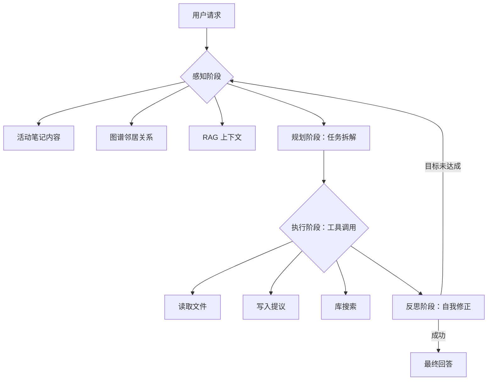

# “三位一体”架构方案：Obsidian 智能助手

## 1. 概述
Obsidian 智能助手的“三位一体”架构旨在将该插件从简单的聊天界面转型为**自主知识代理**。其核心关注点在于深度的库感知（Vault Awareness）、安全的本地优先执行以及长程研究记忆。

## 2. 核心组件

### 2.1 代理循环：库感知的 SPAR (感知-规划-执行-反思)
不同于标准循环，Obsidian 循环是“库感知”的。在**感知 (Sense)** 阶段，它会自动获取当前活动笔记的图谱邻居和元数据。

#### 流程图


### 2.2 工具架构：提议优先契约 (Proposal-First)
所有修改库内容的工具必须遵循“提议 (Proposal)”模式，以确保用户系统的安全。

#### 时序图
```mermaid
sequenceDiagram
    participant LLM as 模型
    participant Loop as 代理循环
    participant Tool as 写入工具
    participant UI as Obsidian 界面
    participant Vault as 库

    LLM->>Loop: 调用 write_file(路径, 内容)
    Loop->>Tool: 使用参数执行
    Tool-->>Loop: 返回 { type: "提议", 内容 }
    Loop-->>UI: 渲染差异视图 (提议)
    UI->>User: "确认修改？"
    User->>UI: 点击 "应用"
    UI->>Vault: 写入磁盘
    Vault-->>Loop: 成功
    Loop->>LLM: 返回工具结果: 成功
```

### 2.3 自主记忆：研究工作区
代理在插件文件夹中维护一个专门的记忆文件，用于追踪进行中的研究和用户偏好。

*   **工作记忆 (Working Memory)**：存储在 `memory.json`。追踪跨多个文件编辑的状态。
*   **上下文压缩**：使用“历史摘要”模式。当上下文达到 10k token 时，中间工具结果被总结为“研究日志”块。

## 3. 实施路线图
1. 将 `ChatService` 重构为 `AutonomousAgentLoop`。
2. 使用 `Zod` schema 标准化所有工具定义名。
3. 实现 `HistoryCompactor` 以管理长程研究会话。

