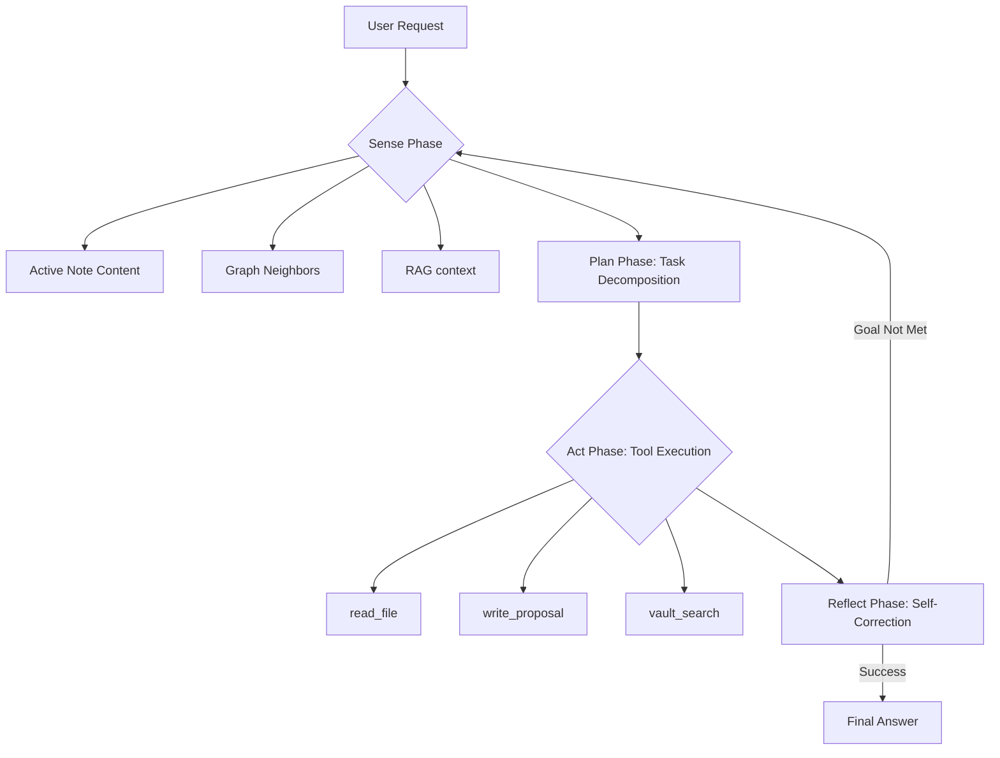

# Trinity Architecture: Obsidian Intelligence Assistant

## 1. Overview
The "Trinity" architecture for Obsidian Intelligence Assistant transforms the plugin from a simple chat interface into an **Autonomous Knowledge Agent**. It focuses on deep vault awareness, safe local-first execution, and long-term research memory.

## 2. Core Components

### 2.1 Agent Loop: Vault-Aware SPAR (Sense-Plan-Act-Reflect)
Unlike standard loops, the Obsidian loop is "Vault-Aware". In the **Sense** phase, it automatically retrieves the graph neighbors and metadata of the active note.

#### Flowchart


### 2.2 Tool Architecture: Proposal-First Contract
All tools modifying the vault must follow the "Proposal" pattern to ensure user safety.

#### Sequence Diagram
```mermaid
sequenceDiagram
    participant LLM
    participant Loop as Agent Loop
    participant Tool as WriteFileTool
    participant UI as Obsidian UI
    participant Vault

    LLM->>Loop: call write_file(path, content)
    Loop->>Tool: Execute with args
    Tool-->>Loop: Return { type: "write_proposal", content }
    Loop-->>UI: Render Diff View (Proposal)
    UI->>User: "Confirm changes?"
    User->>UI: Click "Apply"
    UI->>Vault: Write to disk
    Vault-->>Loop: Success
    Loop->>LLM: Return tool_result: success
```

### 2.3 Autonomous Memory: Research Workspace
The Agent maintains a dedicated memory file within the plugin folder to track ongoing research and user preferences.

*   **Working Memory**: Stored in `memory.json`. Tracks state across multiple file edits.
*   **Context Compaction**: Uses the "Summary-of-History" pattern. When context reaches 10k tokens, intermediate tool results are summarized into a "Research Log" block.

## 3. Implementation Roadmap
1. Refactor `ChatService` into `AutonomousAgentLoop`.
2. Standardize all tools using `Zod` schemas.
3. Implement `HistoryCompactor` to manage long research sessions.

